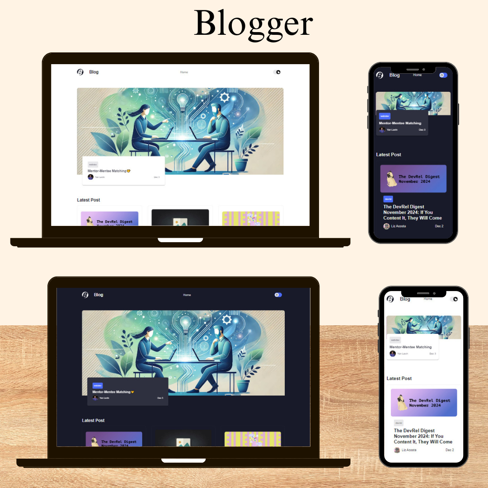

# Blog App 📝  
**Blog App** is a responsive web application built using React.js and Material-UI. It fetches and displays dynamic articles from a **REST API** while offering seamless navigation and state management. The app also supports light and dark themes for an enhanced user experience.

---

##  Live Demo   
  

---

## Features  
- **Dynamic Blog Posts:** Fetch and display articles from a REST API.  
- **Author Insights:** Navigate to view more details about each blogger and their posts.  
- **Light and Dark Themes:** Toggle between light and dark modes using Material-UI's theming system.  
- **Smooth Navigation:** Seamless routing and page transitions with React Router DOM.  
- **Responsive Design:** Fully optimized for desktops, tablets, and mobile devices.  

---

## Technologies  
- **React.js:** For building interactive and dynamic UI components.  
- **Material-UI:** For modern and consistent styling and theming.  
- **Context API:** For efficient state management across the application.  
- **React Router DOM:** For dynamic and declarative routing.  
- **REST API:** For fetching real-time articles and user data.  
- **JavaScript (ES6):** For modern and efficient data handling and logic.  

---

## Technical Details  

### API Integration  
The app interacts with a REST API to fetch dynamic content. Example endpoint:  
[https://api.example.com/articles](https://dev.to/api/articles)

### Theme Toggle  
- Material-UI's theming system enables dynamic light/dark mode toggling.  
- State management via Context API ensures a smooth user experience across the app.

### Responsive Layout  
- Material-UI’s Grid and Box components ensure the app is fully responsive.  
- The design adapts seamlessly to various screen sizes, offering an optimal experience.

### State Management  
- Context API is used for managing global state, such as theme toggling and user preferences.  
- It simplifies passing props between deeply nested components.

---
